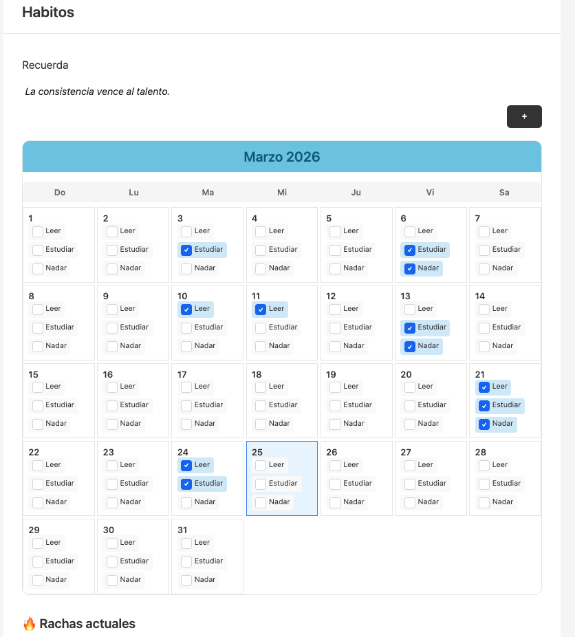

# Habit Tracker

Habit Tracker es una aplicación web de seguimiento de hábitos que permite a los usuarios registrar y monitorear sus actividades diarias o semanales. El proyecto está diseñado para ayudar a crear consistencia en las rutinas personales mediante la visualización de un tablero mensual y el seguimiento de rachas (streaks).

---
Tecnologías

- Vanilla JavaScript (ES6 Modules)
- HTML5
- CSS3
- Sin framework ni dependencias externas
---
Requisitos previos
- Node.js instalado en el sistema

---
Cómo ejecutar el proyecto

En la terminal, ejecutar:

> npx serve

Luego abrir http://localhost:3000 en el navegador.

---
Persistencia de datos

> Nota: Actualmente los datos NO se persisten. Toda la información (hábitos, registros, rachas) se guarda en memoria y se pierde al recargar la página.
---

Estado actual del proyecto

Funcionalidades implementadas:

- ✅ Crear hábitos (diarios/semanales)
- ✅ Registro de check-ins con fecha
- ✅ Cálculo de rachas (streaks) por tipo de frecuencia
- ✅ Tablero mensual visual
- ✅ Citas motivacionales
- ✅ Modal para crear/registrar hábitos

Funcionalidades faltantes:
- ❌ Mostrar rachas (la sección existe en UI pero no se renderiza correctamente)
- ❌ Sección de estadísticas al término de la semana
- ❌ Conexión a un backend para persistencia
- ❌ Consulta de hábitos mensuales
---

App

---
> Nota: Este proyecto aún no ha sido terminado.
---